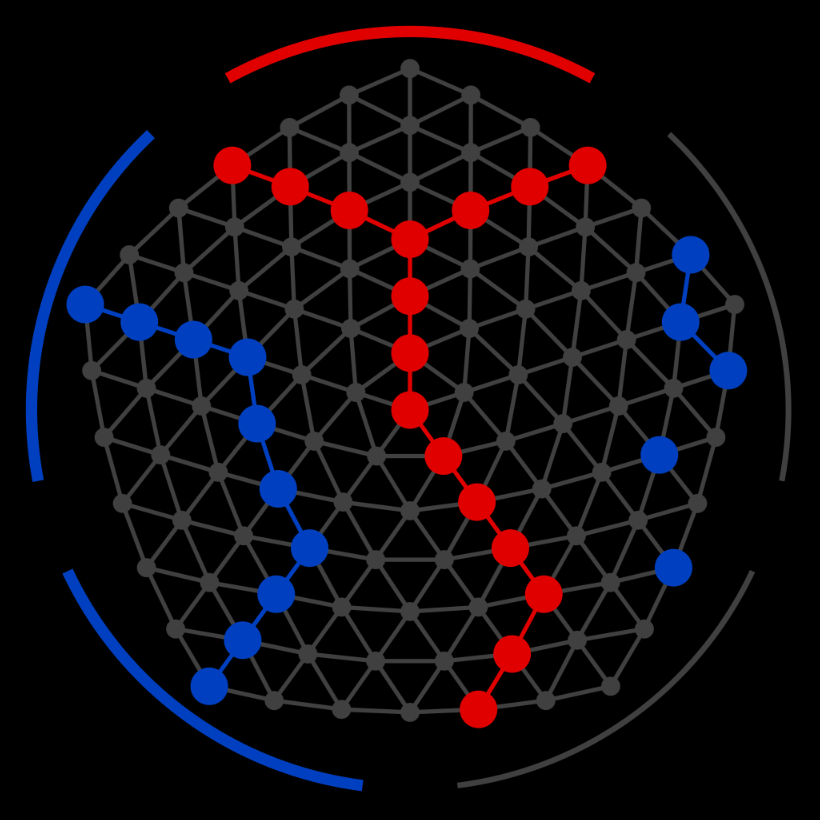

# Poly-Y for Android

Poly-Y is an abstract board game for two players.

## Summary of the rules

Players take turns placing stones of their color on empty fields. Corners of
the board can be captured by connecting the two adjacent sides with an arbitrary
third side, creating a <b>Y</b> shape. The player that captures at least 3 of
the 5 corners of the board wins.

In the example above, red has captured the top corner by connecting the adjacent
top-left and top-right sides with the bottom side of the board. Meanwhile, blue
has captured two corners on the left side of the board. Corner fields count as
connecting to both adjacent sides, so blue's stones on the left connect three
adjacent sides.

After the first player places his first stone, the second player may replace
that stone with one of her own color (but only on her first turn!). This forces
the first player to choose a first move that is neither too strong nor too weak.

## More information

Game description: https://boardgamegeek.com/boardgame/179816/poly-y

The version of the game uses a board with 5 sides and side length 7,
as was used in the 2014 CodeCup: https://archive.codecup.nl/2014/

The AI is based on Lynx3 by Lesley Wevers & Steven te Brinke,
which won the CodeCup: https://github.com/lwevers/lynx/
